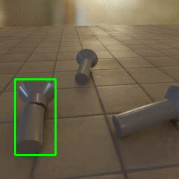
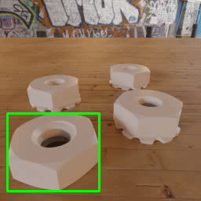
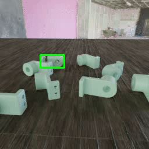
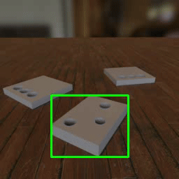
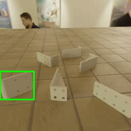
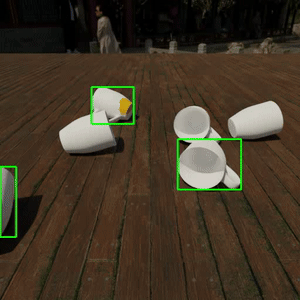

# Dataset - Odd-One-Out: Anomaly Detection by Comparing with Neighbors 

> The input of the framework is a set of sparse view images of a scene containing multiple objects. We aim to detect 'odd-looking' objects that contain manufacturing errors (e.g., different geometry, texture) or damages (e.g., cracks, fractures).

## 🎯 ToysAD-8K and PartsAD-15K datasets

- The `ToysAD-8K` and  `PartsAD-15K` dataset are available for download [here](https://huggingface.co/datasets/ankankbhunia/odd-one-out/tree/main).
- `ToysAD-8K` includes real-world objects from multiple categories and `PartsAD-15K` comprises a diverse set of mechanical object parts.
- Both datasets consist of multiple scene folders, each containing `RGB` rendered images, `masks`, and `segmentations` annotations for each multiview image along with their metadata.
- Different types of abnormalities include: missing parts, broken/fracture/cracks parts, mis-alignments, texture mismatch.
- The datasets are divided into chunks of 5GB. We provide scripts to download both datasets.

<table>
  <tr>
    <td><b>Dataset name</b></td>
    <td><b>Command</b></td>
    <td><b>Total size</b></td>
    <td><b>Comments</b></td>
  </tr>
      <tr>
    <td><a href="https://huggingface.co/datasets/ankankbhunia/odd-one-out/tree/main">ToysAD-8K</a></td>
    <td><em>bash data/download.sh toysAD8K</em></td>
    <td>40 GB</td>
    <td>Rendered using <a href="https://rehg.org/publication/dataset2/">Toys4K</a>* shapes (Creative Commons and royalty-free licenses)</a></td>
  </tr>
    <tr>
    <td><a href="https://huggingface.co/datasets/ankankbhunia/odd-one-out/tree/main">PartsAD-15K</a></td>
    <td><em>bash data/download.sh partsAD15K</em></td>
    <td>94 GB</td>
    <td>Rendered using <a href="https://deep-geometry.github.io/abc-dataset/">ABC</a>* shapes  (MIT827 license)</td>
</table>

*This repository does not claim ownership of the shapes in the original dataset. To obtain the original shape data, please refer to their official dataset pages. You can retrieve the shape_ids from .json files in the scene folders.

## More Examples

 

<table>
  <tr>
    <td>🔖 click to preview dataset images</td>
    <td></td>
    <td></td>
    <td></td>
    <td></td>
    <td></td>
    <td></td>
  </tr>
</table>
