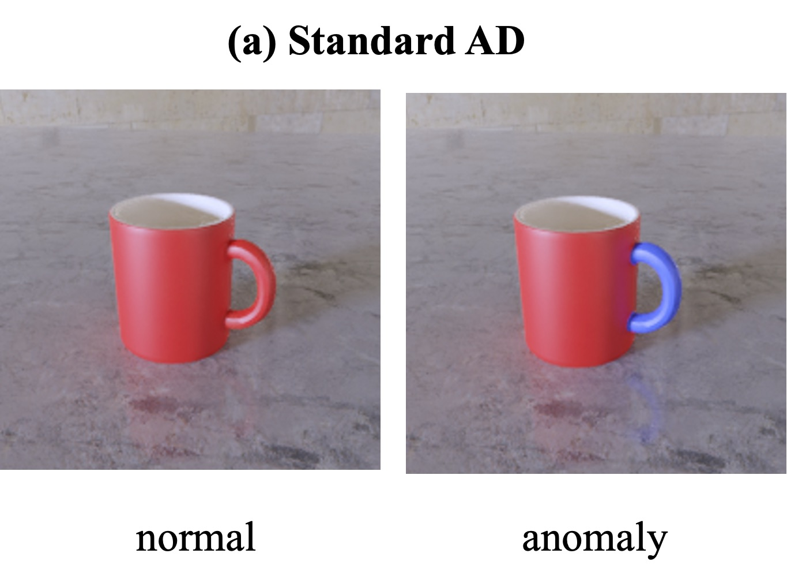
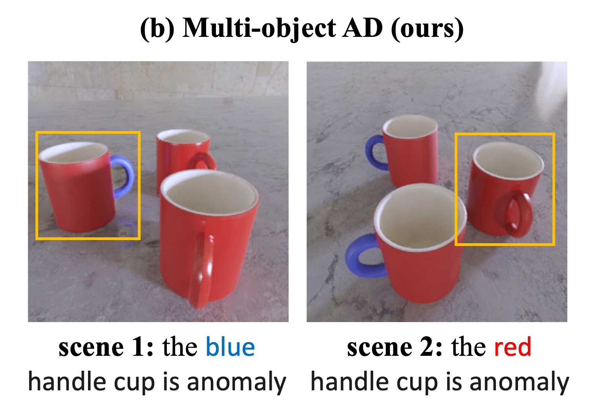

# ⚡ Odd-One-Out: Anomaly Detection by Comparing with Neighbors 

Goal: Detecting 'odd-looking' samples in multi-object scene environments. 

<table>
  <tr>
      <strong><a href="https://arxiv.org/abs/2406.20099">Odd-One-Out: Anomaly Detection by Comparing with Neighbors</a></strong> 
      Ankan Bhunia, Changjian Li, Hakan Bilen 
  </tr>
</table>

## 🌀 Ours Multi-object AD vs Previous Works

<table>
    <tr>
    <td></td>
    <td>The input is usually an image of single object. In this setting,
      <ul>
        <li>Anomalies are instance-specific.</li> 
        <li>This setting suffers from <b>ambiguous</b> definition of regularity (e.g., both cups in the example can be either normal or anomalous based on what the manufacturer wants to produce).</li>
        <li>To resolve the ambiguity an explicit specification of regularity is required to provide (e.g., <a href="https://github.com/VICO-UoE/Looking3D">Looking3D</a>).</li>
      </ul>
    </td>
    </tr>
    <tr>
      <td></td>
      <td>The input of the framework is a set of sparse view images of a scene containing multiple objects. We aim to detect 'odd-looking' objects that contain manufacturing errors (e.g., different geometry, texture) or damages (e.g., cracks, fractures).
      <ul>
        <li>Anomalies are scene-specific.</li>
        <li>Explicit specification of regularity is not required when seeing objects in group. Majority of objects are normal, which act as regularity reference. </li>
        <li>This is useful in quality control in bulk production.</li>
      </ul>
      </td>
    </tr>
</table>

## 🎯 More examples

<table>
  <tr>
    <td></td>
    <td></td>
    <td></td>
  </tr>
  <tr>
    <td></td>
    <td></td>
    <td></td>
  </tr>
</table>

## ⚡ Codes and Dataset coming soon! 
