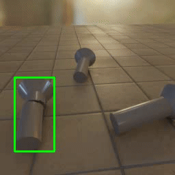
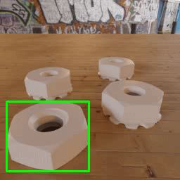
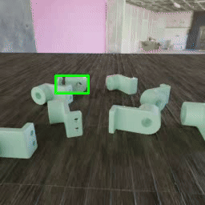
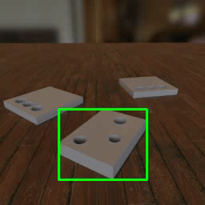
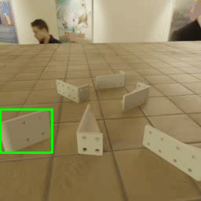
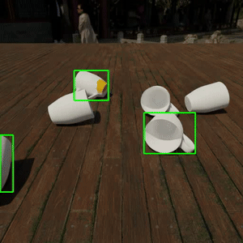

# Odd-One-Out: Anomaly Detection by Comparing with Neighbors 

Goal: Detecting 'odd-looking' samples in multi-object scene environments. 

<table>
  <tr>
      <strong><a href="https://arxiv.org/abs/xxxxxx">Odd-One-Out: Anomaly Detection by Comparing with Neighbors</a></strong> 
      Ankan Bhunia, Changjian Li, Hakan Bilen 
  </tr>
</table>

The input of the framework is a set of sparse view images of a scene. 

<table>
  <tr>
    <td></td>
    <td></td>
    <td></td>
  </tr>
  <tr>
    <td></td>
    <td></td>
    <td></td>
  </tr>
</table>

# Codes and Dataset coming soon! 
