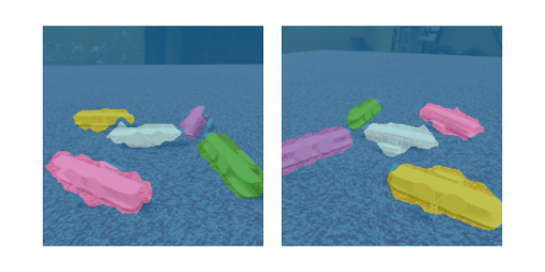
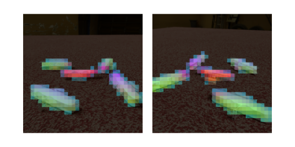
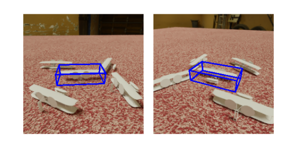
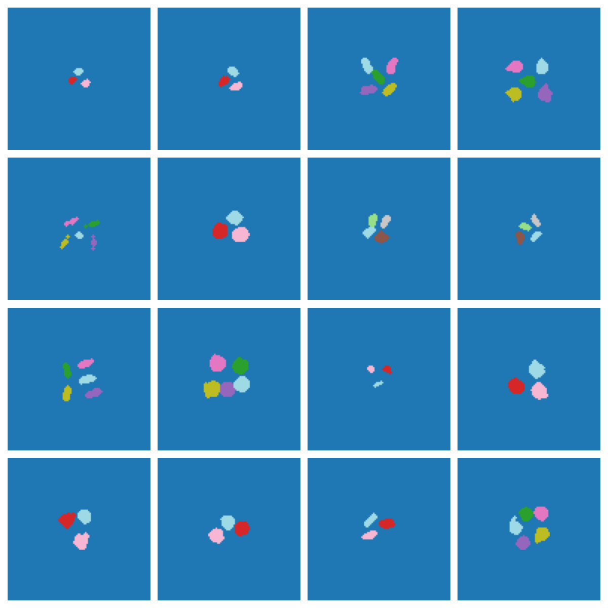
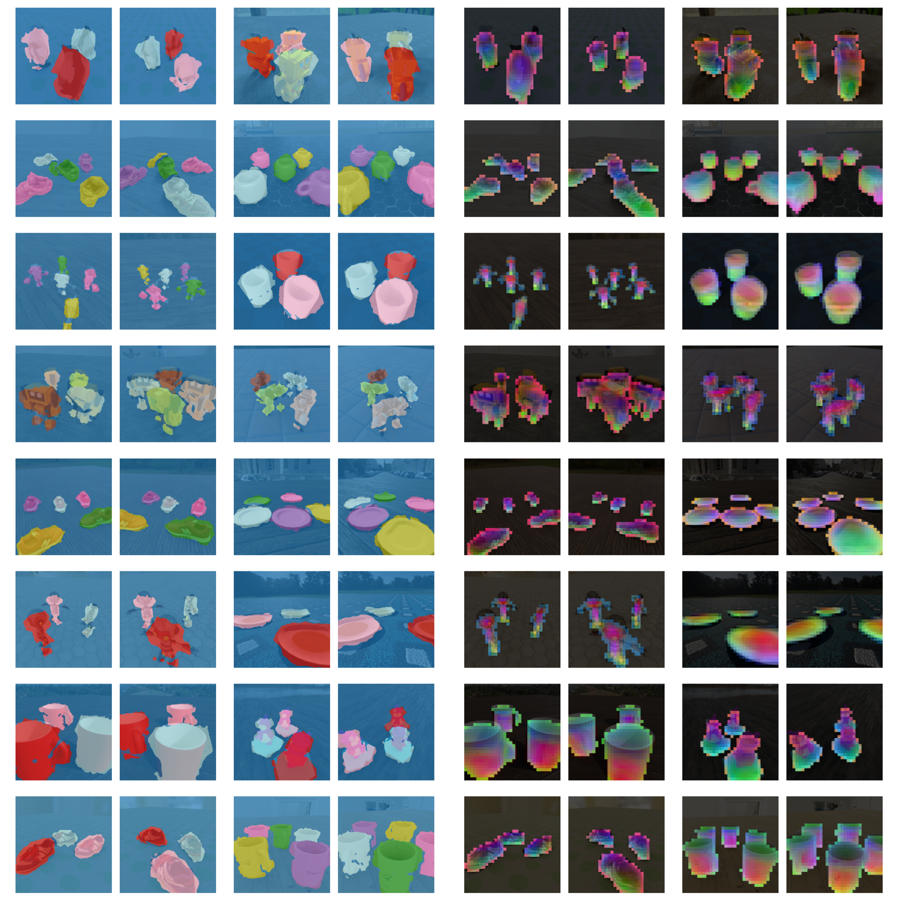

# [CVPR 2025] Odd-One-Out: Anomaly Detection by Comparing with Neighbors 

This repository contains the official code release for the CVPR 2025 paper "Odd-One-Out: Anomaly Detection by Comparing with Neighbors".

<table>
  <tr>
      <strong><a href="https://arxiv.org/abs/2406.20099">Odd-One-Out: Anomaly Detection by Comparing with Neighbors</a></strong><br>
      Ankan Bhunia, Changjian Li, Hakan Bilen<br>
  </tr>
</table>

[](https://arxiv.org/abs/2406.20099)
[](https://huggingface.co/datasets/ankankbhunia/odd-one-out/tree/main)

## Installation

To set up the environment, please follow these steps:

```bash
conda create -n oddoneout python=3.8 -y ## 3.8 version is important
conda activate oddoneout 
pip install -r requirements.txt
pip install "git+https://github.com/facebookresearch/pytorch3d.git" ## takes lots of time
pip install 'git+https://github.com/facebookresearch/detectron2.git' ## takes lots of time
```
## Dataset

See the ```DATASET.md``` for downloading the dataset. Put it anywhere and give the extracted dataset path in the ```.yaml``` config file.


## Training

Download the detectron2's backbone weights `R-50.pth` from [here](https://huggingface.co/datasets/ankankbhunia/odd-one-out/resolve/main/R-50.pth) and put it under the `weights/` folder. You can achieve the same by running the below code:

```bash
mkdir -p weights
wget https://huggingface.co/datasets/ankankbhunia/odd-one-out/resolve/main/R-50.pth -O weights/R-50.pth
```

Our training process consists of two stages: 3D Object Training and Correspondence Learning (Stage 1), followed by Anomaly Classification Training (Stage 2).

### 3D Object Training and Correspondence Learning (Stage 1)

First, we pretrain the 3D scene reconstruction pipeline using a 2D rendering loss. Our pipeline leverages DiNov2 feature rendering loss to build a geometrically consistent and correspondence-aware 3D feature volume.

To run Stage 1 training:

```bash
python train.py --mode 3d_training --exp_name OddOneOut-toys8k --config_path configs/default_toys8k.yaml --epochs 50
```

**Note:** For a batch size of 4, training requires approximately 35-40 GB of GPU memory. We conducted our experiments on a single A40 GPU, where the training proved stable across all experiments. When training from scratch on newer GPU architectures (e.g., Nvidia L40s), please monitor the `render_loss_rgb` during initial epochs. If it grows very high at start, restarting the training might be necessary.

Upon successful completion of this stage, you should observe `batch_cardinality_accuracy_test` values close to 1 in the terminal log.

We also provide pretrained weights for this stage [here](https://huggingface.co/datasets/ankankbhunia/odd-one-out/resolve/main/toys8k-oddoneout-stage1-epoch_50.pt). You can download it along with other model weights as described in the "Model Weights" section below.

### Anomaly Classification Training (Stage 2)

Once Stage 1 training is complete, proceed to train the full network with the classification loss. You **must** provide the `resume_ckpt` argument with the model weights obtained from Stage 1.

```bash
python train.py --mode cls_training --exp_name OddOneOut-toys8k --config_path configs/default_toys8k.yaml --resume_ckpt <MODEL_WEIGHT_FILEPATH> --epochs 50
```

This code will first estimate 3D bounding boxes of the training scenes and save them in a JSON file, which are then utilized during network training.

Note: Multi-GPU training is supported using `python -m torch.distributed.launch --nproc_per_node=<num_gpus> --master_port 48949 train.py <args>`. Please be aware that adjusting the batch size and learning rate may be necessary to ensure training stability.


## Model Weights

We open-source the trained model weights for both stages. Run the following code to download them all together and place them in the `checkpoints/` folder:

```bash
mkdir -p checkpoints
MODEL_NAMES=(
    "toys8k-oddoneout-stage1-epoch_50.pt"
    "toys8k-oddoneout-stage2-epoch_50.pt"
    "parts15k-oddoneout-stage1-epoch_50.pt"
    "parts15k-oddoneout-stage2-epoch_50.pt"
)
BASE_URL="https://huggingface.co/datasets/ankankbhunia/odd-one-out/resolve/main"

for MODEL_NAME in "${MODEL_NAMES[@]}"; do
    wget "${BASE_URL}/${MODEL_NAME}" -O "checkpoints/${MODEL_NAME}"
done
```


## Evaluation

To obtain the AUROC and Accuracy of the trained model, please run the following code:

```bash
python test.py --config_path configs/default_toys8k.yaml --resume_ckpt <MODEL_WEIGHT_FILEPATH> 
```


## Inference, model visualizations and quick demo

Our code utilizes `build_network` to instantiate a `model` object. This `model` provides two primary inference methods: `model.eval_3d` and `model.eval_cls`. The `eval_3d` method outputs a reconstructed scene, 3D bounding boxes, and various visualizations, while `eval_cls` delivers the final anomaly prediction.

You can visualize the 3D representation, object separations and final anomaly detection output using the `demo.py` file. Locate the latest checkpoint `.pt` path of your trained model, or download our pretrained model from [this link](LINK_TO_FULL_MODEL_WEIGHTS).

To run the visualization:

```bash
python demo.py --scene_path /data/toysAD8K/toysad8k/scene_0001/ --resume_ckpt <MODEL_WEIGHT_FILEPATH> --config_path configs/default_toys8k.yaml
```

A collection of images will be saved under the `output_visualizations` folder.

The `output_visualizations` folder contains various images generated by the pipeline. Here's a table showing each visualization type with an example image and its description:


<table>
  <thead>
    <tr>
      <th width="30%">Image</th>
      <th width="70%">Description</th>
    </tr>
  </thead>
  <tbody>
    <tr>
      <td></td>
      <td><strong>Object Clustering Top View</strong> (<code>*_obj_clustering_visualization_topview.png</code>): From the reconstructed 3D volume (density), we apply a threshold to obtain a 3D volume mask of the scene and then use clustering to separate each object. A top view is shown here. Each color represent a different object in the scene.</td>
    </tr>
    <tr>
      <td></td>
      <td><strong>Rendered Segmentation Mask (Overlapped)</strong> (<code>*_rendered_seg_mask_overlapped.png</code>): Shows rendered segmentation masks with the same color coding as above, but overlaid on input RGB images.</td>
    </tr>
    <tr>
      <td></td>
      <td><strong>Rendered DINOv2 Feature Visualization (Overlapped)</strong> (<code>*_rendered_dinov2_feat_visualization_overlapped.png</code>): Shows the rendered 3D features overlaid on input RGB images. This visualizes the correspondence capability of our learned 3D representation.</td>
    </tr>
    <tr>
      <td></td>
      <td><strong>Anomaly Classification Visualization</strong> (<code>*_anomaly_classification_visualization.png</code>): Highlights the final anomaly detection within the scene.</td>
    </tr>
  </tbody>
</table>

## ... More Visualizations

As above, each scene is shown with two views.

1. Object clustering
   

2. Segmentation mask & Feature visualizations
   

## Data Visualizations

We also provide 3D tool to visualize each scene data in a browser. 


To obtain similar visualization run the following command and go to http://localhost:8000.

```bash
python visualize_data.py --scene_path ./data/sample_scene_data/
```

## Data rendering codes

For the data rendering codebase, please refer to [https://github.com/ankanbhunia/realistic-render-engine](https://github.com/ankanbhunia/realistic-render-engine). This repository contains scripts for photorealistic rendering of multiple objects within a scene.
 
## Cite our work!
```
@article{bhunia2024odd,
  title={Odd-One-Out: Anomaly Detection by Comparing with Neighbors},
  author={Bhunia, Ankan and Li, Changjian and Bilen, Hakan},
  journal={CVPR},
  year={2025}
}
```


## License
This work is licensed under the Creative Commons Attribution-Non Commercial ShareAlike 4.0 International License. 
To view a copy of this license, visit Legal Code - https://creativecommons.org/licenses/by-nc-sa/4.0/legalcode.en
